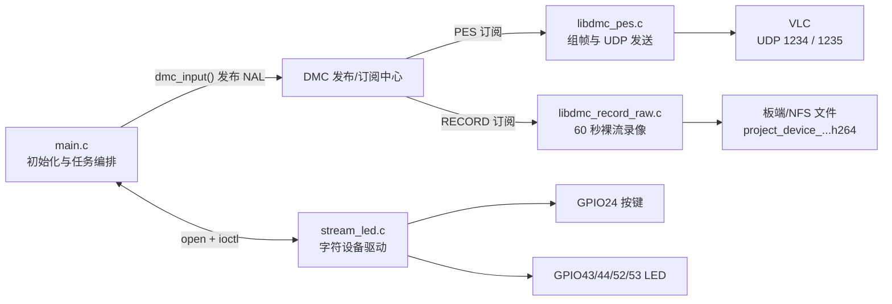
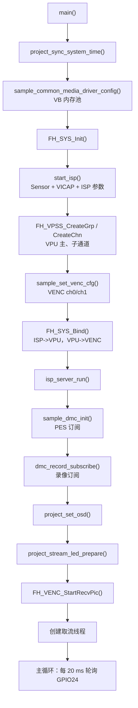
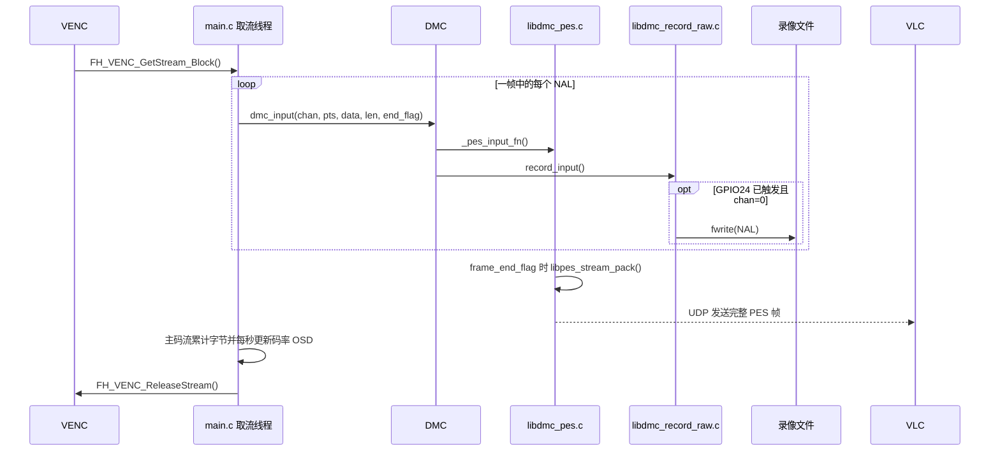
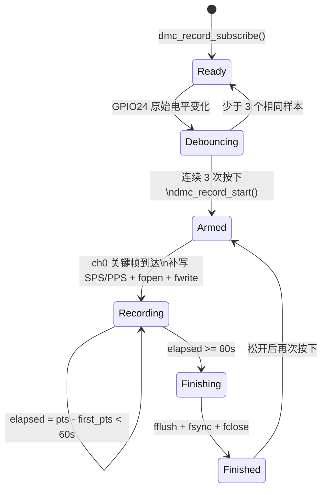
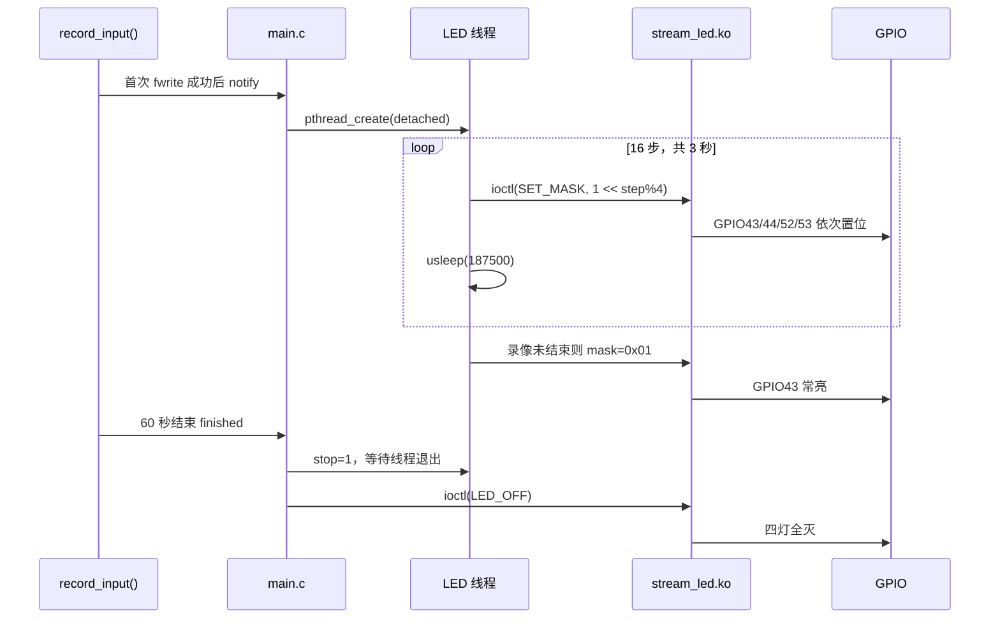
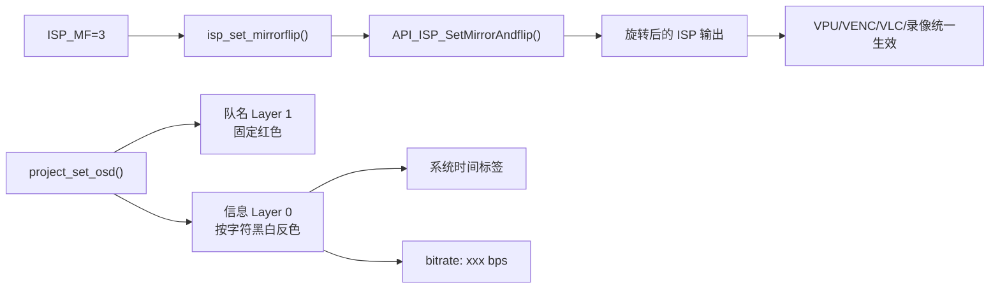

# FH8862 大作业代码阅读与答辩手册

> 项目：四大三队 FH8862 视频处理系统  
> 你的任务：GPIO24 按键控制 60 秒录像、GPIO43/44/52/53 三秒流水灯、录像结束全部灭灯，以及主/子码流。  
> 本文和新增源码注释均使用 UTF-8 编码。

## 1. 一分钟讲清项目

本项目在 FH8862 上完成视频采集、处理、编码、分发和外设控制：

1. IMX415 Sensor 采集原始图像。
2. VICAP 接收数据，ISP 完成曝光、白平衡、方向等处理。
3. VPU 把同一输入缩放成两路画面。
4. VENC 通道 0 编码主码流：1280x720、25 fps、H.264 CBR 1.75 Mbps。
5. VENC 通道 1 编码子码流：640x360、15 fps、H.264 CBR 512 Kbps。
6. 取流线程取得 H.264 NAL 后交给 DMC 分发。
7. PES 把主、子码流通过 UDP 1234、1235 发给 VLC。
8. RECORD 只接收主码流；GPIO24 稳定按下后才写 60 秒 H.264。
9. 第一段录像数据写入成功后，独立线程播放三秒流水灯。
10. 流水结束后 GPIO43 常亮；录像文件关闭后四灯全部熄灭。

答辩的一句话版本：

> 我把 GPIO24 按键通过字符设备传到用户程序，经软件消抖后请求主码流 IDR；录像从带 SPS/PPS 的可解码关键帧开始并按 PTS 精确计时，首段落盘后异步播放三秒流水灯，结束时统一关闭全部 LED，同时主、子码流始终独立发往 VLC。

## 2. 总的实现逻辑

### 2.1 媒体数据流

```text
IMX415 Sensor -> VICAP -> ISP -> VPU Group 0
                                  |
                                  +-> VPU ch0 (1280x720)
                                  |      -> VENC ch0 (25fps, 1.75Mbps)
                                  |      -> DMC -> PES -> UDP 1234 -> VLC主码流
                                  |             -> RECORD -> 60秒H.264
                                  |
                                  +-> VPU ch1 (640x360)
                                         -> VENC ch1 (15fps, 512Kbps)
                                         -> DMC -> PES -> UDP 1235 -> VLC子码流
```

两路共用 Sensor 和 ISP，但从 VPU 输出开始使用独立通道。录像回调主动过滤 `media_chn != 0`，所以子码流只预览，不写入板端录像。

### 2.2 按键到录像

```text
GPIO24物理低电平
 -> stream_led.ko读取GPIO
 -> ioctl(STREAM_LED_GET_KEY)
 -> main.c每20ms轮询，连续3次相同才确认（约60ms消抖）
 -> 检测稳定的松开到按下变化
 -> dmc_record_start()设置active=1
 -> FH_VENC_RequestIDR(0)，等待主码流关键帧
 -> 补写SPS/PPS，创建文件、记录first_pts、写入IDR及后续NAL
```

按键后不直接 `sleep(60)`。录像真正开始点是可解码关键帧成功写入的时刻，代码用该关键帧 PTS 作为时间原点，可排除按键后等待 IDR、文件创建和线程调度误差。

### 2.3 录像与灯的状态

```text
IDLE
  | GPIO24稳定按下
  v
ARMED(active=1，请求并等待主码流IDR)
  | SPS/PPS与关键帧首个NAL写入成功
  v
RECORDING
  | 创建detached灯效线程
  | GPIO43->44->52->53，循环4轮，共3秒
  | 三秒后GPIO43常亮
  | PTS差达到60秒
  v
FINISHING
  | fflush -> fsync -> fclose
  | 通知灯线程停止 -> 等待退出 -> LED_OFF
  v
FINISHED
```

### 2.4 为什么灯效单独用线程

取流线程要持续取帧、分发并及时 `FH_VENC_ReleaseStream()`。流水灯每步休眠 187.5 ms，若在录像回调内执行会阻塞取流 3 秒，造成编码缓冲积压、VLC 卡顿甚至丢帧。

独立线程使媒体实时路径和灯效并行。录像完成时先通知灯线程停止，等线程结束再灭灯，可避免“已经灭灯，灯线程又执行一次 ioctl 点亮 LED”的竞态。

### 2.5 四个核心文件如何协作



这四个文件的边界很清楚：`main.c` 负责流程控制，`libdmc_pes.c` 负责网络预览，`libdmc_record_raw.c` 负责文件录像，`stream_led.c` 负责内核中的 GPIO 访问。录像模块和 PES 模块都只是 DMC 的订阅者，因此增加录像不会破坏原有 VLC 预览。

### 2.6 程序启动调用链



按代码顺序可这样讲：

1. `project_sync_system_time()` 先确定 OSD 的时间来源。优先取 NFS 新文件的 `mtime`，其次使用有效板端时钟，最后使用编译时间兜底。
2. `sample_common_media_driver_config()` 和 `FH_SYS_Init()` 建立视频缓冲池与媒体系统。
3. `start_isp()` 完成 Sensor 回调注册、VICAP 输入、ISP 参数文件加载；此时只初始化，不立即跑 ISP 工作线程。
4. `FH_VPSS_CreateGrp()` 创建 VPU 组；通道 0 输出 1280x720，通道 1 输出 640x360。
5. `sample_set_venc_cfg()` 分别创建 VENC ch0/ch1，并设置帧率、CBR、码率和 GOP。
6. `FH_SYS_Bind()` 建立 `ISP -> VPU -> VENC` 数据关系，之后才调用 `isp_server_run()`，避免输出端未准备好。
7. `sample_dmc_init()` 注册 PES 订阅，`dmc_record_subscribe()` 再注册录像订阅，两个订阅者可同时收到主码流。
8. `project_set_osd()` 配置队名层与信息层；`project_stream_led_prepare()` 打开 `/dev/stream_led` 并探测驱动能力。
9. 两路 `FH_VENC_StartRecvPic()` 后创建取流线程。主线程不处理视频帧，只做 GPIO24 轮询与退出清理。

初始化顺序不能任意交换。前一级为后一级提供缓冲、数据源或回调，顺序错误通常表现为 SDK 的 `not ready`、取流失败或启动阶段段错误。

### 2.7 一帧视频从编码器到 VLC 和录像文件



这里最重要的是缓冲区所有权：`frame_data` 指向 VENC 内部缓冲，并不是本项目 `malloc` 出来的。DMC 当前采用同步回调，所以 PES 和 RECORD 必须在 `dmc_input()` 返回前使用完数据。只有全部 NAL 处理完后，取流线程才能调用 `FH_VENC_ReleaseStream()`；忘记释放会逐渐耗尽编码缓冲，过早释放则可能写入损坏数据。

主、子码流可能交错到达，因此 `libdmc_pes.c` 用 `media_chn` 作为数组下标，为每个通道保存独立的 `g_nalu_count[]`、`g_frame_length[]` 和 `g_stream_element[]`。`frame_end_flag=1` 时只打包并清空当前通道。

### 2.8 GPIO24 到 60 秒录像的状态机



关键实现不是“按键后睡眠 60 秒”，而是两段控制：

1. `project_record_button_poll()` 每 20 ms 读取一次 `PROJECT_LED_GET_KEY`。连续 3 次相同才更新稳定状态，只在 `0 -> 1` 按下沿调用 `dmc_record_start()`。
2. `dmc_record_start()` 将通道 0 状态设为 `active`，并调用 `FH_VENC_RequestIDR(0)`。`record_input()` 会跳过依赖旧参考帧的 P 帧，直到关键帧到达才 `fopen("wb")`，并把关键帧 PTS 记为 `first_pts`。
3. 录像订阅从编码启动时持续缓存 SPS/PPS。若强制 IDR 没有重复携带参数集，回调会先把缓存的 SPS/PPS 写入文件头，再写 IDR，保证裸 H.264 可被 VLC 独立打开。
4. 每次回调计算 `elapsed_us = frame_pts - first_pts`。达到 60 秒时在当前帧第一个 NAL 写入前停止，保证文件以完整帧结束。
5. `finish_record()` 执行 `fflush -> fsync -> fclose`，打印实际字节数和时长，再调用 `project_recording_led_finished()` 全部灭灯。

录像只接受 `media_chn == 0 && media_type == H264`。通道 1 会被录像回调立即过滤，但仍会继续进入 PES 订阅者，因此录像期间两路 VLC 都不中断。

### 2.9 流水灯与字符驱动调用链



`stream_led.c` 的职责分为三层：

| 层次 | 代码 | 作用 |
| --- | --- | --- |
| 引脚复用 | `stream_led_set_pinmux()` | `ioremap()` 映射寄存器，只修改 `[27:24]` 为 GPIO 模式 |
| GPIO 资源 | `gpio_request()`、`gpio_direction_*()` | 申请 GPIO43/44/52/53 输出和 GPIO24 输入 |
| 用户接口 | `register_chrdev()`、`device_create()`、`stream_led_ioctl()` | 创建 `/dev/stream_led`，处理灯位图和按键读取 |

GPIO24 按键为低电平有效，驱动内部用 `gpio_get_value()` 读取后转换成“按下=1”，让用户态无需了解硬件电平极性。`GET_KEY` 通过 `copy_to_user()` 返回值，不能直接解引用用户地址。灯的 `SET_MASK` 参数由 `ioctl` 的第三个参数携带，低四位分别映射四个 GPIO。

### 2.10 OSD、旋转与码率的实现位置



- **旋转 180 度**：`isp_set_param(ISP_MF, HOMEWORK_ISP_ORIENTATION)` 进入 `isp_set_mirrorflip()`，最终调用 `API_ISP_SetMirrorAndflip()` 同时设置 mirror 与 flip。功能位于 ISP 层，所以后续预览、录像和推流天然一致。
- **队名 OSD**：`project_set_osd()` 加载 GB2312 字库，把“四大三队”的 GB2312 字节写入 `FHT_OSD_TextLine_t.textInfo`；队名单独使用 layer 1，固定红色且禁用反色。
- **自动反色**：信息 layer 0 设置 `FH_OSD_INVERT_BY_CHAR`、白色 `normalColor` 和黑色 `invertColor`。SDK 按字符区域检测背景亮度，长日期跨越明暗区域时可逐字符切换。
- **系统时间**：时间行写入 SDK 的年、月、日、时、分、秒标签，值来自 Linux 系统时钟，不是在代码中每秒拼接日期字符串。
- **实时码率**：取流线程只累计主码流实际 NAL 字节，每当 PTS 窗口达到 1 秒，按 `bytes * 8 * 1000000 / elapsed_us` 计算 bps，并调用 `FHAdv_Osd_SetTextLine()` 更新。

### 2.11 正常退出与资源释放顺序

按 `Ctrl+C` 后，信号函数只设置 `g_sig_stop`，不在异步信号上下文中调用 SDK、`fclose` 或 `ioctl`。主循环退出后按以下顺序清理：

```text
g_get_stream_stop = 1
 -> project_stream_led_stop()：停止灯线程、LED_OFF、close设备
 -> dmc_record_unsubscribe()：移除回调、关闭未完成文件、释放状态数组
 -> main返回
```

完整工程若继续补强退出流程，可在取流线程确认退出后，再依次停止 VENC、解除 Bind、关闭 VPU/ISP 和执行 `FH_SYS_Exit()`。当前作业的关键保证是：录像文件一定关闭，灯一定全灭，回调状态不会在释放后继续被访问。

## 3. Project 每个目录和文件的作用

| 路径 | 作用 | 阅读优先级 |
| --- | --- | --- |
| `src/` | 用户空间应用：媒体初始化、取流、DMC、UDP、录像 | 最高 |
| `led_driver/` | GPIO24 和四路 LED 字符驱动、独立测试程序 | 最高 |
| `inc/` | 本项目模块头文件，声明 DMC、PES、录像接口 | 高 |
| `include/` | FH8862 SDK 头文件，定义 ISP/VPU/VENC/VB API | 查阅，不通读 |
| `lib/static/` | 链接进程序的厂商静态库 `.a` | 知道用途即可 |
| `lib/dynamic/` | 厂商动态库 `.so` | 知道用途即可 |
| `lib/*.hex` | Sensor ISP 参数；本板使用 `imx415_mipi_attr.hex` | 知道放到 `/home` |
| `driver/` | 媒体内核模块、DSP 固件和加载脚本 | 高 |
| `tools/` | PC 端录制 UDP 的 Windows/Ubuntu 脚本 | 中 |
| `docs/` | 作业要求参考图片 | 低 |
| `E11_demo.si4project/` | Source Insight 索引、缓存、备份 | 不看，不参与编译 |
| `Makefile` | 交叉编译用户程序和 LED 驱动 | 高 |
| `make.sh` | 一键编译并复制到 NFS | 中 |
| `README.md` | 最短运行提示 | 中 |
| `PROJECT_FEATURES.md` | 已实现功能、运行、VLC 和验收步骤 | 高 |
| `DEFENSE_GUIDE.md` | 本文：阅读重点、原理和答辩问答 | 最高 |

## 4. 哪些 .c 必须重点看

### 4.1 第一优先级：与你的任务直接相关

#### `src/main.c`

在文件内搜索“答辩重点”，精读：

- `PROJECT_LED_*`：用户态与驱动共享的 ioctl 命令。
- `project_stream_led_prepare()`：打开设备并探测驱动能力。
- `project_record_button_poll()`：GPIO24 轮询、60 ms 消抖、按下沿触发。
- `project_recording_led_thread()`：四灯循环 16 步，共 3 秒。
- `project_recording_led_notify()`：创建 detached 灯线程。
- `project_recording_led_finished()`：停止线程并关闭全部 LED。
- `HOMEWORK_MAIN_*`、`HOMEWORK_SUB_*`：主子码流参数。
- `sample_common_get_stream_proc()`：从编码器取两路流并送 DMC。
- `sample_create_vpu_channel()`：创建子码流 VPU 输出。
- `sample_set_venc_cfg()`：H.264、CBR、帧率、码率、GOP。
- `main()`：VPU/VENC 创建、Bind 和线程启动顺序。

#### `src/libdmc_record_raw.c`

这是按键录像核心：

- `record_file_info`：录像状态、首 PTS、字节数和 `FILE *`。
- `dmc_record_start()`：按键触发后武装录像，不阻塞等待。
- `record_input()`：只接收 ch0，创建文件、按 NAL 写入、比较 PTS。
- `finish_record()`：刷盘、关闭文件、打印时长/大小、通知灭灯。

必须能解释：为什么用 PTS，不用 `sleep(60)`；为什么达到 60 秒的那一帧不写；`fflush/fsync/fclose` 的区别。

#### `led_driver/stream_led.c`

这是内核空间代码：

- `stream_led_pins[]`：GPIO43/44/52/53 和 pinmux 地址。
- `STREAM_KEY_GPIO`：GPIO24。
- `stream_led_set_pinmux()`：`ioremap/readl/writel/iounmap`。
- `stream_led_apply_mask()`：位图变成四路 GPIO 电平。
- `stream_led_ioctl()`：用户态控制入口。
- `stream_led_init()/exit()`：申请、注册、创建设备和逆序释放。

#### `src/libdmc_pes.c`

这是主子码流预览关键：

- 每通道独立的 `g_frame_length[]`、`g_nalu_count[]` 和组帧结构。
- ch0 使用 1234，ch1 使用 1235。
- 最后一个 NAL 到达时才 PES 打包。

不能让两个通道共用 NAL 状态，否则两路帧交错时会拼错。

### 4.2 第二优先级：理解架构

- `src/libdmc.c`：发布-订阅分发器。取流线程输入一次，PES 和 RECORD 同时收到数据；只传指针，不复制大帧。
- `src/libpes.c`：PES 封装和 UDP 发送。无需逐行看，知道作用即可。
- `src/isp.c`：曝光、白平衡、亮度、降噪、翻转控制封装。
- `src/sensor.c`：IMX415 初始化、寄存器、曝光和增益回调。

### 4.3 不建议通读

- `include/**/*.h`：遇到 API 或结构体字段时查。
- `inc/font_array.h`：大字库数组，不读。
- `lib/**/*.a`、`lib/**/*.so`：已编译厂商库。
- `E11_demo.si4project/`：编辑器索引，不是业务代码。

## 5. 功能与代码对照

| 功能 | 用户态代码 | 内核态/底层 |
| --- | --- | --- |
| GPIO24 读取 | `project_record_button_poll()` | `STREAM_LED_GET_KEY` |
| 软件消抖 | `raw_state/stable_state/same_sample_count` | 无 |
| 启动录像 | `dmc_record_start()` | VENC 已持续编码 |
| 精确 60 秒 | `frame_pts-first_pts` | 编码器提供 PTS |
| 文件落盘 | `record_input()/finish_record()` | Linux VFS/NFS |
| 三秒流水灯 | `project_recording_led_thread()` | `stream_led_apply_mask()` |
| 录像中状态灯 | 流水结束设置 bit0 | bit0=GPIO43 |
| 结束全灭 | `project_recording_led_finished()` | `STREAM_LED_OFF` |
| 主码流 | VPU/VENC ch0，UDP 1234 | FH8862 VPU/VENC |
| 子码流 | VPU/VENC ch1，UDP 1235 | FH8862 VPU/VENC |
| 录像只取主流 | `media_chn == 0` | 无 |
| 实时码率 OSD | `homework_update_bitrate_osd()` | OSD SDK |

## 6. 你负责的功能逐段讲解

### 6.1 GPIO24 从硬件到用户态

1. 驱动用 pinmux 地址 `0x04020134` 把引脚配置为 GPIO24。
2. `gpio_request(24, ...)` 声明驱动拥有该 GPIO，防止其他驱动占用。
3. `gpio_direction_input(24)` 配置输入。
4. 用户程序 `open("/dev/stream_led", O_RDWR)` 获得文件描述符。
5. 用户程序执行 `ioctl(fd, PROJECT_LED_GET_KEY, &pressed)`。
6. 驱动读取电平。按键低有效，物理 0 转换成逻辑 `pressed=1`。
7. 驱动用 `copy_to_user()` 安全复制结果。

### 6.2 软件消抖

主循环 20 ms 调用一次 `project_record_button_poll()`。连续三次状态相同才更新稳定状态，确认时间约 60 ms：

- `raw_state`：最近一次原始电平；
- `same_sample_count`：连续相同次数；
- `stable_state`：已经认可的状态。

只在稳定状态变为 1 时触发。长按时状态不再变化，因此不会重复启动；松开后回到 0，下一次按下才能再次触发。

### 6.3 录像开始

`dmc_record_start()` 不新建进程，也不停止 VLC，只复位单次录像状态、置 `active=1` 并调用 `FH_VENC_RequestIDR(0)`。`record_input()` 等到主码流关键帧时：

1. 确认是 H.264 ch0；
2. 若当前关键帧未携带参数集，则从缓存补写 SPS/PPS；
3. 用 `fopen(..., "wb")` 创建或覆盖文件；
4. 保存关键帧 PTS；
5. 写入 IDR 及后续 NAL；
6. 首次有效数据写成功后通知流水灯。

### 6.4 三秒流水灯

`step % 4` 产生 0、1、2、3，`1UL << n` 产生：

| 值 | mask | LED |
| --- | --- | --- |
| 0 | `0x01` | GPIO43 |
| 1 | `0x02` | GPIO44 |
| 2 | `0x04` | GPIO52 |
| 3 | `0x08` | GPIO53 |

每步 187.5 ms，16 步：

```text
187.5 ms x 16 = 3000 ms
```

四个 LED 一轮，所以总共四轮。结束后若录像仍进行，设置 `0x01` 让 GPIO43 常亮。

### 6.5 结束时关闭全部 LED

当 `frame_pts - first_pts >= 60,000,000`：

1. 不写当前帧，保证结尾是上一完整帧；
2. `fflush()` 刷 C 库缓冲；
3. `fsync()` 提交内核文件缓冲；
4. `fclose()` 关闭文件；
5. 设置灯线程停止标志；
6. 等灯线程退出；
7. 调用 `LED_OFF`，驱动把 mask 置 0。

等待灯线程退出很重要，否则录像线程灭灯后，灯线程可能又执行一次 ioctl 点亮某灯。

### 6.6 主子码流

主码流：

- VPU ch0 -> VENC ch0；
- 1280x720、25 fps、1.75 Mbps、GOP 50；
- UDP 1234；
- VLC 预览并参与板端录像。

子码流：

- VPU ch1 -> VENC ch1；
- 640x360、15 fps、512 Kbps、GOP 30；
- UDP 1235；
- 只用于 VLC 预览。

两者 GOP 都约两秒：`50/25=2`，`30/15=2`。

## 7. 与课程知识点对应

### 7.1 嵌入式系统组成

- 硬件：FH8862 SoC、Cortex-A7、IMX415、GPIO 按键和 LED；
- 内核：Linux 4.9，管理内存、设备、进程和调度；
- 驱动：媒体模块和 `stream_led.ko`；
- 用户应用：`project_fh8862`；
- PC 应用：VLC；
- 网络：PES over UDP。

### 7.2 用户空间与内核空间

```text
用户态main.c --open/ioctl--> /dev/stream_led
                         --file_operations--> 内核驱动
```

- 用户态不能直接调用内核 GPIO API；
- `copy_to_user()` 安全地把按键值送到用户地址；
- `ioremap()` 把物理 pinmux 地址映射成内核虚拟地址；
- ioctl 命令号是两侧共同遵守的 ABI。

### 7.3 Linux 系统编程与驱动

系统编程：`open/fopen/fwrite/fsync/close`、`ioctl`、`pthread_create`、`signal`、`settimeofday`、socket。

驱动编程：`module_init/exit`、`register_chrdev`、`class_create/device_create`、`gpio_request`、`copy_to_user`、`ioremap/readl/writel`。

### 7.4 多线程和多进程

本项目是一个进程、多个线程：

- 主线程：初始化、按键轮询、退出；
- 取流线程：处理两路编码输出；
- 灯效线程：三秒 GPIO 时序；
- ISP 线程：运行图像处理服务。

线程共享地址空间、开销低；进程地址隔离更强，通常用管道、消息队列、共享内存或 socket 通信。灯效没有必要创建独立进程。

### 7.5 栈、堆和视频缓冲

栈：

- 函数局部变量，如 `step` 和 `FH_VENC_STREAM stream`；
- 生命周期随函数调用结束；
- 取流线程栈为 64 KiB，灯线程为 16 KiB。

堆：

- `g_record_files = malloc(...)` 动态分配录像状态；
- 注销时 `free()`；
- ISP 参数缓冲也使用 `malloc/free`。

全局区：

- `g_stream_led_fd`、线程标志、码率统计器；
- 生命周期覆盖整个进程。

视频缓冲：

- 由 FH8862 SDK/VB 管理；
- GetStream 返回临时地址；
- ReleaseStream 后不能再访问。

### 7.6 设备调试

建议逐层排查：

1. `lsmod` 看模块；
2. `ls -l /dev/stream_led` 看设备节点；
3. `./stream_led_test` 独立测试 GPIO；
4. `dmesg` 看驱动、Sensor 和 ISP；
5. 看应用 VPU/VENC/DMC 日志；
6. VLC 分别监听 1234、1235；
7. 检查录像完成日志、文件大小和 ffprobe。

### 7.7 视频处理系统

- Sensor：输出 Bayer RAW；
- VICAP：采集接口；
- ISP：曝光、白平衡、降噪、色彩、方向；
- VPU：缩放、裁剪、Mask；
- VENC：H.264 压缩；
- OSD：队名、时间、码率；
- DMC/PES：数据分发和网络封装。

### 7.8 视频编解码

- H.264 是有损压缩；
- I 帧可独立解码，P 帧依赖参考帧；
- GOP 是相邻 I 帧间隔；
- CBR 是平均码率控制目标，不是每秒字节绝对相等；
- 一帧可能含多个 NAL，`frame_end_flag` 标记最后一个；
- 本项目保存裸 H.264，没有 MP4/TS 容器索引。

### 7.9 网络和协议

- IP 指定接收主机，本项目通常是 Windows 有线网卡 `192.168.1.2`；
- 端口区分两路流：1234 主流、1235 子流；
- UDP 无连接、低延迟，但不保证到达、顺序和重传；
- PES 封装编码帧；
- VLC 解封装、解码并显示。

实时预览选 UDP，是因为低延迟比绝对可靠更重要；TCP 丢包重传可能积累延迟。

## 8. 高频答辩问答

### Q1：你具体做了什么？

我实现 GPIO24 按键触发录像、约 60 ms 软件消抖、主动请求 IDR 并补写 SPS/PPS、关键帧落盘后异步播放四路三秒流水灯、录像期间 GPIO43 常亮，以及 60 秒结束后全部灭灯；同时实现主子码流的独立 VPU/VENC 通道和 UDP 端口。

### Q2：为什么不用 sleep(60)？

`sleep` 测线程时间且会阻塞。PTS 表示视频时间轴，用第一帧 PTS 和当前 PTS 相减，误差约一帧，也不影响 VLC。

### Q3：PTS 是什么？

Presentation Timestamp，帧在视频时间轴上的显示时间。本 SDK 单位是微秒。

### Q4：按键如何消抖？

每 20 ms 采样，连续三次相同才确认，约 60 ms；只处理稳定的松开到按下边沿，长按不会重复。

### Q5：为什么按键放在驱动？

GPIO 是硬件资源，应由内核统一申请和管理；用户程序通过稳定 ioctl 接口读取。

### Q6：为什么 GET_KEY 用 copy_to_user？

内核不能直接信任用户指针，copy_to_user 会检查并安全复制，失败返回 `-EFAULT`。

### Q7：为什么用 ioctl？

按键和 LED mask 是控制操作，不是连续数据流。ioctl 命令能明确区分 ON、OFF、SET_MASK 和 GET_KEY。

### Q8：流水灯怎么保证三秒？

每步 187500 微秒，共 16 步，等于 3000000 微秒；四灯一轮，共四轮。

### Q9：为什么流水灯用线程？

灯效会等待 3 秒，放在编码回调会阻塞取流和 ReleaseStream；独立线程不影响录像和 VLC。

### Q10：录像结束为何一定全灭？

先设置灯线程停止标志，等待线程结束，再执行 LED_OFF，避免灭灯后线程又点亮。

### Q11：主子码流为什么互不影响？

它们使用 VPU ch0/ch1、VENC ch0/ch1、独立参数、独立组帧状态和端口；录像只接受 ch0。

### Q12：为什么每通道独立 NAL 计数？

两路数据会交错到达。共用计数会把不同通道 NAL 拼成同一帧，导致码流损坏。

### Q13：CBR 为什么不等于固定文件大小？

CBR 是平均目标。I 帧、画面复杂度、量化和编码头会造成瞬时波动，最终看一分钟总大小。

### Q14：为什么是 .h264，不是 MP4？

编码器直接输出 H.264 NAL，当前模块写裸流，开销低；MP4 还需容器复用、索引和尾部元数据。

### Q15：fflush、fsync、fclose 区别？

`fflush` 清 C 库缓冲，`fsync` 要求内核提交文件数据，`fclose` 关闭并释放文件对象。

### Q16：录像文件在哪里？

相对路径写进程序当前目录。在 `/mnt/Project` 运行就保存到那里，NFS 下 Ubuntu 同时可见。

### Q17：为什么必须 ReleaseStream？

它把编码器缓冲归还池中；不释放会耗尽缓冲，最终取不到新帧。

### Q18：程序是多线程还是多进程？

一个进程、多线程。主线程、取流线程和灯线程共享地址空间，没有 fork。

### Q19：UDP 和 TCP 区别？

UDP 无连接、不重传、延迟低；TCP 可靠有序但重传会增加延迟。实时预览选 UDP。

### Q20：什么是交叉编译？

在 x86 Ubuntu 上用 `arm-fullhanv3-linux-uclibcgnueabi-gcc` 生成 ARM Cortex-A7 程序，产物只能在 FH8862 运行。

### Q21：.ko、.a、.so 是什么？

- `.ko`：内核模块，由 insmod 加载；
- `.a`：静态库，链接进可执行文件；
- `.so`：动态库，运行时加载。

### Q22：insmod 报 resource busy 是什么？

通常是旧驱动已申请同一 GPIO。停止应用、卸载旧 `Led.ko`，再加载 `stream_led.ko`，必要时重启。

## 9. 编译、运行和演示

Ubuntu 编译：

```sh
cd ~/resource/Project
chmod +x make.sh
./make.sh
```

开发板：

```sh
mount -t nfs 192.168.1.1:/mnt/nfs_share /mnt -o nolock

cd /mnt/Project/driver
chmod +x load_modules_FH8862.sh
./load_modules_FH8862.sh
cp -f ../lib/imx415_mipi_attr.hex /home/

cd /mnt/Project
rmmod Led 2>/dev/null
rmmod stream_led 2>/dev/null
insmod stream_led.ko
chmod +x stream_led_test project_fh8862
./stream_led_test
./project_fh8862 192.168.1.2 1234
```

VLC：

- 主码流：`udp://@:1234`
- 子码流：`udp://@:1235`

现场演示顺序：

1. 展示 `lsmod` 和 `/dev/stream_led`。
2. 同时打开 VLC 1234、1235。
3. 未按键时说明只预览、四灯灭。
4. 按 GPIO24，展示录像开始日志。
5. 展示 43、44、52、53 三秒流水。
6. 三秒后指出 GPIO43 常亮表示仍在录像。
7. 60 秒后展示完成日志和四灯全灭。
8. 在 Ubuntu 播放/验收 H.264。

## 10. 今晚复习顺序

1. 先看本文第 1、2、6、8 节。
2. 在 `src/main.c` 搜索“答辩重点”。
3. 精读 `project_record_button_poll()` 和三个 `project_recording_led_*`。
4. 精读 `record_input()`、`dmc_record_start()`、`finish_record()`。
5. 精读 `stream_led_ioctl()` 和驱动 init/exit。
6. 看 `libdmc_pes.c` 的通道数组和端口循环。
7. 看 `main()` 中两路 VPU/VENC 和 Bind。
8. 最后只概览 ISP、OSD 等组员功能。

最后记住四句话：

1. GPIO24 由驱动读取，用户态 ioctl 获取，20 ms x 3 软件消抖。
2. DMC 同时把主码流交给 PES 和 RECORD，子码流只用于 PES 预览。
3. 录像等待可解码关键帧并用 PTS 计时，关键帧落盘才启动独立灯线程。
4. 结束时先停止灯线程再 LED_OFF，保证四灯全部熄灭。
